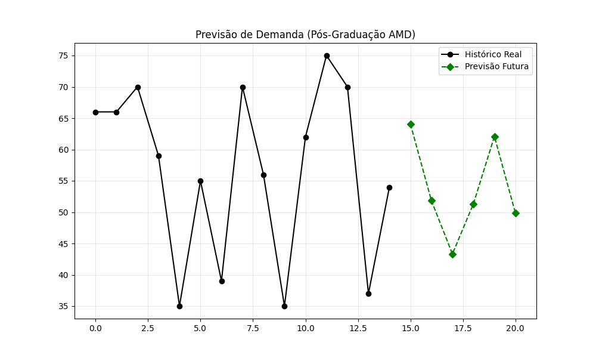
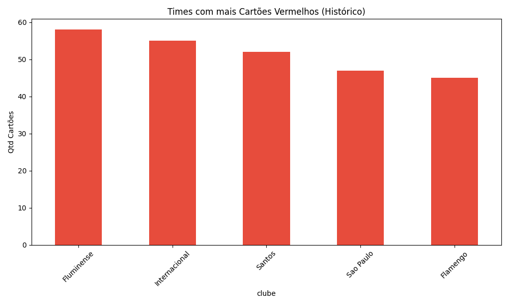

# Portfolio-Ciencia-Dados
Projetos de Análise de Dados e Machine Learning (Python).
Bem-vindo ao meu laboratório de dados. Aqui, combino minha experiência em comunicação com técnicas de **Python, Machine Learning e Engenharia de Dados** para extrair histórias reais de bases complexas.

---

## 🚀 Projetos em Destaque

### 1. 🔮 Previsão de Vendas com Inteligência Artificial
**Objetivo:** Prever a demanda futura de vendas para otimizar estoques.
- **Técnica:** Utilizei o algoritmo **Holt-Winters (Statsmodels)** para modelar séries temporais com sazonalidade e tendência.
- **Resultado:** O modelo aprendeu o padrão histórico e gerou uma projeção para os próximos 6 meses (Linha Verde no gráfico).
- **Ferramentas:** Python, Pandas, Matplotlib.

### 2. ⚽ Análise do Brasileirão (Engenharia de Dados)
**Objetivo:** Investigar mitos do futebol através de dados estatísticos (2003-2023).
- **Descoberta 1:** Times com jogador expulso perdem em **51%** das partidas.
- **Descoberta 2:** O lateral Fábio Santos tem melhor aproveitamento em pênaltis que a maioria dos atacantes.
- **Ferramentas:** ETL com Pandas, Visualização de Dados.

---

## 🛠️ Tech Stack
* **Linguagens:** Python, JavaScript.
* **Análise:** Pandas, NumPy, Statsmodels.
* **Visualização:** Matplotlib.
* **Ambiente:** VS Code, Google Colab.

---
*“Dados são apenas números até que alguém conte a história deles.”*
